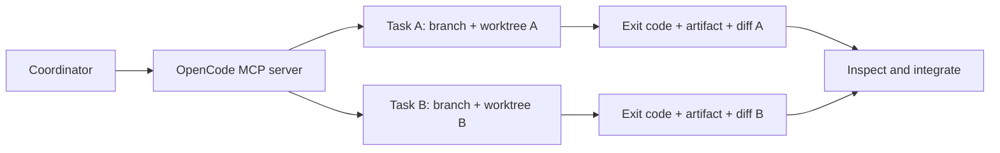

# OpenCodeSkills

[](LICENSE)
[](https://opencode.ai/docs/skills/)
[](mcp/opencode-subagents/README.md)
[](https://nodejs.org/)
[](https://git-scm.com/docs/git-worktree)

Run independent OpenCode tasks in separate Git worktrees and collect verifiable results before combining their changes. The toolkit includes three native skills and a stdio MCP server that limits concurrency and returns each task's status, exit code, stdout and stderr.

**Start here:** [Quick start](#quick-start) · [Skills](#skills) · [MCP setup](mcp/opencode-subagents/README.md) · [Parallel example](examples/parallel-demo.mjs) · [Русский](README.md)

## Why use it

- **Separate changes:** every Git task gets its own branch and worktree.
- **Bound parallel work:** up to four active runs, with timeouts and cancellation.
- **Check the result:** inspect exit codes, actual output files and diffs before integration.
- **Keep commands intact:** preserve PowerShell arguments and Unicode across SSH and WinRM.

## Skills

| Component | Practical use |
| --- | --- |
| [Parallel agents](opencode-parallel-agents/SKILL.md) | Split independent tasks, collect results and integrate inspected changes |
| [PowerShell invocation](powershell-invocation/SKILL.md) | Preserve arguments and Unicode across PowerShell, SSH and WinRM |
| [GitHub CI debugging](gh-fix-ci/SKILL.md) | Read failed GitHub Actions checks and find the relevant failure |
| [OpenCode MCP server](mcp/opencode-subagents/README.md) | `spawn`, `wait`, `result`, `cancel`; isolated Git branches |

## Quick start

Requirements: **Node.js 22+**, **Git**, the **OpenCode CLI** and an authenticated provider that supports the server's configured model. The CI debugging skill also needs **Python 3.10+** and authenticated **GitHub CLI (`gh`)**.

Run these commands from the project that will receive the skills:

```sh
git clone https://github.com/krotname/OpenCodeSkills.git
mkdir -p .opencode/skills
cp -R OpenCodeSkills/opencode-parallel-agents OpenCodeSkills/powershell-invocation OpenCodeSkills/gh-fix-ci .opencode/skills/
node OpenCodeSkills/scripts/verify.mjs
```

<details>
<summary>PowerShell</summary>

```powershell
git clone https://github.com/krotname/OpenCodeSkills.git
New-Item -ItemType Directory -Path .opencode/skills -Force | Out-Null
Copy-Item -Recurse -Path OpenCodeSkills/opencode-parallel-agents, OpenCodeSkills/powershell-invocation, OpenCodeSkills/gh-fix-ci -Destination .opencode/skills
node OpenCodeSkills/scripts/verify.mjs
```

</details>

The checks use a deterministic CLI stand-in and make no model calls. Copy the complete skill folders, including the `gh-fix-ci` helper and its license. For a global installation, use `~/.config/opencode/skills` as the destination.

The parallel agents skill also needs the [MCP server configured](mcp/opencode-subagents/README.md#configure). The other skills can be used independently. The same stdio server works with compatible MCP clients.

## How parallel tasks work



Start both tasks with `spawn` before waiting for either one. Use `wait` to follow a run, `result` to inspect its status and output, and `cancel` to stop that exact run. [Tool inputs and results](mcp/opencode-subagents/README.md#configure).

## Try the parallel example

```sh
cd OpenCodeSkills
node examples/parallel-demo.mjs
```

The demo makes **two real model calls** in distinct worktrees, prints the run IDs and directories, and verifies these artifacts:

| Artifact | Verified content |
| --- | --- |
| `parallel-demo.txt` | `PARALLEL_TEXT_OK` |
| `parallel-demo.json` | `{"ok":true,"task":"parallel-json"}` |

Read the [MCP setup](mcp/opencode-subagents/README.md) before the demo. The model and variant are fixed in the server; requests cannot change them. A provider error or quota failure is reported as a failed run.

## Integration boundaries

- Worktrees start from **committed HEAD**; uncommitted changes are not copied.
- Child commits are **not merged automatically**. Inspect the diff and artifacts first.
- Non-Git directories have a **single-writer lock**.
- Keep each returned worktree while its artifacts are needed.

## Updates and contributions

Found a reproducible problem? [Open an issue](https://github.com/krotname/OpenCodeSkills/issues) with the command, expected result and actual result. Small, focused pull requests are welcome.

This repository is a curated export maintained from a private source. Only explicitly selected files enter the public history; export checks run before publication. Changes to exported files are reconciled with the source before the next export, so an export stops rather than overwriting an independent edit.

## License and maintainer

[Apache-2.0](LICENSE). Bundled upstream licenses and attribution are retained in [NOTICE](NOTICE) and [gh-fix-ci/LICENSE.txt](gh-fix-ci/LICENSE.txt).

Maintained by [Andrei Ovcharenko (@krotname)](https://github.com/krotname).
