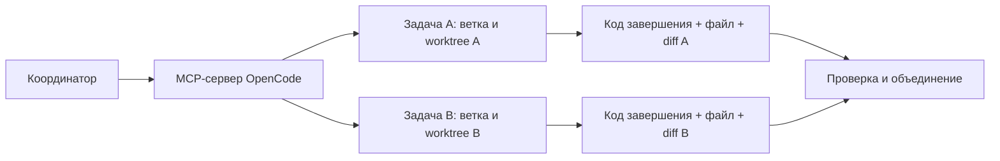

# OpenCodeSkills

[](LICENSE)
[](https://opencode.ai/docs/skills/)
[](mcp/opencode-subagents/README.md)
[](https://nodejs.org/)
[](https://git-scm.com/docs/git-worktree)

Запускайте независимые задачи OpenCode в отдельных Git worktree и проверяйте результаты перед объединением изменений. В набор входят три штатных навыка и stdio MCP-сервер: он ограничивает параллельную работу и возвращает статус, код завершения, stdout и stderr каждой задачи.

**Быстрый переход:** [Установка](#быстрый-старт) · [Навыки](#навыки) · [Настройка MCP](mcp/opencode-subagents/README.md) · [Пример двух задач](examples/parallel-demo.mjs) · [English](README.en.md)

## Зачем это нужно

- **Разделить изменения:** каждая Git-задача получает свою ветку и worktree.
- **Ограничить параллельную работу:** до четырёх активных запусков, тайм-ауты и отмена.
- **Проверить результат:** код завершения, настоящий файл и diff перед объединением.
- **Сохранить команды:** аргументы PowerShell и Unicode при работе через SSH и WinRM.

## Навыки

| Компонент | Польза |
| --- | --- |
| [Параллельные агенты](opencode-parallel-agents/SKILL.md) | Разделение задач, сбор результатов и объединение проверенных изменений |
| [Вызовы PowerShell](powershell-invocation/SKILL.md) | Аргументы и Unicode при работе через PowerShell, SSH и WinRM |
| [Разбор GitHub CI](gh-fix-ci/SKILL.md) | Поиск причины упавшей проверки GitHub Actions |
| [MCP-сервер OpenCode](mcp/opencode-subagents/README.md) | `spawn`, `wait`, `result`, `cancel`; отдельные Git-ветки |

## Быстрый старт

Нужны **Node.js 22+**, **Git**, **OpenCode CLI** и авторизованный провайдер, который поддерживает модель сервера. Для разбора CI также нужны **Python 3.10+** и авторизованный **GitHub CLI (`gh`)**.

Выполните команды из проекта, в который устанавливаете навыки:

```sh
git clone https://github.com/krotname/OpenCodeSkills.git
mkdir -p .opencode/skills
cp -R OpenCodeSkills/opencode-parallel-agents OpenCodeSkills/powershell-invocation OpenCodeSkills/gh-fix-ci .opencode/skills/
node OpenCodeSkills/scripts/verify.mjs
```

<details>
<summary>PowerShell</summary>

```powershell
git clone https://github.com/krotname/OpenCodeSkills.git
New-Item -ItemType Directory -Path .opencode/skills -Force | Out-Null
Copy-Item -Recurse -Path OpenCodeSkills/opencode-parallel-agents, OpenCodeSkills/powershell-invocation, OpenCodeSkills/gh-fix-ci -Destination .opencode/skills
node OpenCodeSkills/scripts/verify.mjs
```

</details>

Проверка использует управляемый тестовый CLI и не обращается к модели. Копируйте папки навыков целиком, включая helper и лицензию `gh-fix-ci`. Для глобальной установки используйте каталог `~/.config/opencode/skills`.

Навыку параллельной работы также нужна [настройка MCP-сервера](mcp/opencode-subagents/README.md#configure). Остальные навыки работают независимо. Этот же stdio-сервер можно подключить к совместимым MCP-клиентам.

## Как работают параллельные задачи



Сначала вызовите `spawn` для обеих задач, затем ждите результаты. `wait` отслеживает запуск, `result` возвращает статус и вывод, `cancel` останавливает точный запуск. [Параметры и результаты инструментов](mcp/opencode-subagents/README.md#configure).

## Попробовать пример двух задач

```sh
cd OpenCodeSkills
node examples/parallel-demo.mjs
```

Демо делает **два настоящих обращения к модели** в разных worktree, выводит идентификаторы запусков и каталоги, затем проверяет файлы:

| Файл | Проверяемое содержимое |
| --- | --- |
| `parallel-demo.txt` | `PARALLEL_TEXT_OK` |
| `parallel-demo.json` | `{"ok":true,"task":"parallel-json"}` |

Перед запуском прочитайте [настройку MCP](mcp/opencode-subagents/README.md). Модель и вариант закреплены в сервере и не меняются параметрами запроса. Ошибка провайдера или лимита отмечается как неуспешный запуск.

## Объединение изменений

- Worktree создаётся от **закоммиченного HEAD**; незакоммиченные изменения не копируются.
- Ветки **не сливаются автоматически**. Сначала проверьте diff и файлы с результатом.
- В негитовом каталоге действует **блокировка на одного писателя**.
- Сохраняйте выданный worktree, пока нужны созданные в нём файлы.

## Обновления и участие

Нашли воспроизводимую ошибку? [Откройте issue](https://github.com/krotname/OpenCodeSkills/issues) с командой, ожидаемым и фактическим результатом. Небольшие pull request с отдельным исправлением тоже приветствуются.

Это выбранное публичное ядро приватного источника. Экспорт допускает только перечисленные файлы и проверяет их до публикации; приватная история не переносится. Независимая правка публичного файла останавливает следующий экспорт до согласования с источником.

## Лицензия и автор

[Apache-2.0](LICENSE). Исходные лицензии и атрибуция сторонних компонентов сохранены в [NOTICE](NOTICE) и [gh-fix-ci/LICENSE.txt](gh-fix-ci/LICENSE.txt).

Автор: [Андрей Овчаренко (@krotname)](https://github.com/krotname).
