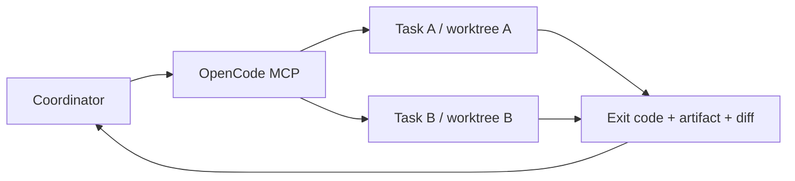

# OpenCodeSkills

Two agents can finish successfully and still leave you with work that cannot be combined. This toolkit gives each development task its own Git worktree, bounds parallel runs and makes the coordinator collect exit codes and real output artifacts.

[Русский](README.ru.md) · [Parallel example](examples/parallel-demo.mjs) · [MCP setup](mcp/opencode-subagents/README.md)

## What is included

| Component | Practical use |
| --- | --- |
| `opencode-parallel-agents` | Split independent tasks, collect results and integrate inspected changes |
| `mcp/opencode-subagents` | `spawn`, `wait`, `result`, `cancel`; four concurrent runs; isolated Git branches |
| `powershell-invocation` | Preserve arguments and Unicode across PowerShell, SSH and WinRM |
| `gh-fix-ci` | Read failed GitHub Actions checks and identify the relevant failure before fixing it |



## Install the skills

Clone this repository and copy the three skill folders into your project's native `.opencode/skills` directory. OpenCode needs each folder's `SKILL.md`; keep the `gh-fix-ci` helper and its license with that skill.

```sh
git clone https://github.com/krotname/OpenCodeSkills.git
mkdir -p .opencode/skills
cp -R OpenCodeSkills/opencode-parallel-agents OpenCodeSkills/powershell-invocation OpenCodeSkills/gh-fix-ci .opencode/skills/
```

```powershell
git clone https://github.com/krotname/OpenCodeSkills.git
New-Item -ItemType Directory -Path .opencode/skills -Force | Out-Null
Copy-Item -Recurse -Path OpenCodeSkills/opencode-parallel-agents, OpenCodeSkills/powershell-invocation, OpenCodeSkills/gh-fix-ci -Destination .opencode/skills
```

Use `~/.config/opencode/skills` for a global installation. The orchestration skill also needs the MCP server configured separately. The other skills can be used independently.

## Run two tasks in parallel

Prerequisites: Node.js 22+, Git, the OpenCode CLI and an authenticated provider that supports the server's configured model. `gh-fix-ci` additionally needs Python 3.10+ and authenticated `gh`.

```sh
cd OpenCodeSkills
node scripts/verify.mjs
node examples/parallel-demo.mjs
```

The verification command uses a deterministic CLI stand-in and makes no model calls. The demo uses two real OpenCode runs: it prints their distinct worktrees and verifies the text and JSON artifacts. Read the [MCP setup](mcp/opencode-subagents/README.md) before the demo. The model and variant are fixed in the server; requests cannot change them.

Worktrees start from committed HEAD. Uncommitted changes are not copied, and child commits are not merged automatically. Non-Git directories have a single-writer lock. Provider quota errors end the affected run and remain visible in its result.

## Updating and contributing

This repository is a curated export maintained from a private source. Only explicitly selected files enter the public history; export checks run before publication. Open an issue with a reproducible failure or a small proposed improvement. Changes to exported files are reconciled with the source before the next export, so an export stops rather than overwriting an independent edit.

Apache-2.0. Bundled upstream licenses and attribution are retained in [NOTICE](NOTICE) and `gh-fix-ci/LICENSE.txt`.
